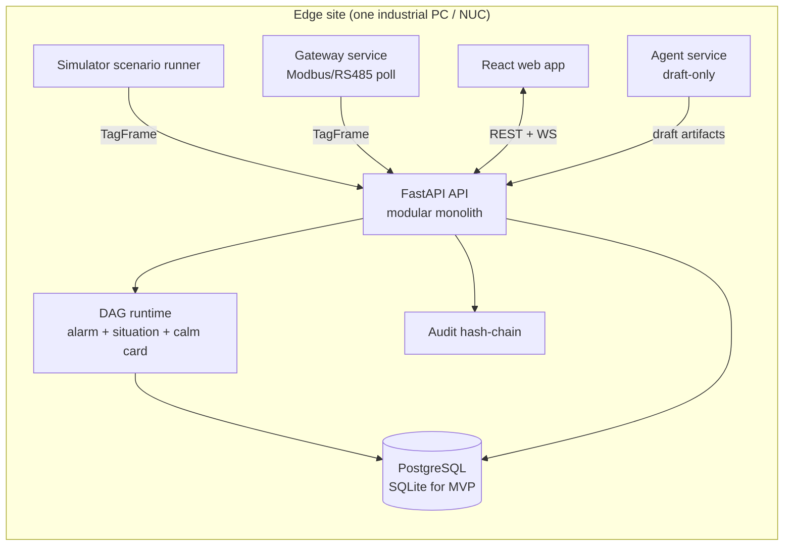

# PlantLens Architecture

This document explains the *system* shape. For files, read the per-folder `README.md`. For the
build sequence, read `BUILD_ORDER.md`.

## The whole picture



## Why these boundaries

- **Gateway is its own process.** Serial timing, register quirks, CRC failures, reconnects —
  all the hardware pain — is quarantined here. If the gateway dies, the API and the last-known
  runtime snapshot survive. The gateway emits the same `TagFrame` the simulator does, so the
  API has exactly one ingestion contract.
- **API is a modular monolith, not microservices.** One FastAPI app with internal modules
  (`ingest`, `runtime`, `studio`, `incidents`, `auth`, `audit`, `ws`). Microservices here would
  be optimizing the pitch deck, not the product. Split out a module into a service only when
  load proves you must.
- **DAG runtime is a pure service layer**, not a side-effect zoo. Given a symptom + the approved
  graph + the latest tags, it returns ranked root-cause candidates with evidence. Same input →
  same output, every time.
- **Agent service is optional and draft-only.** It calls safe API endpoints that return draft
  artifacts. A connectivity failure to the LLM provider must never break the live HMI.

## The three layers of truth (data model)

1. **Plant model (authored)** — `plant.json`, `tag_map.json`, `alarm_rules.json`,
   `causal_graph.json`, `action_envelope.yaml`. Authored in Studio forms, validated against
   contracts, compiled + hashed + versioned. This is *what exists*.
2. **Event model (immutable)** — tag frames, alarm events, acks, scenario injections, operator
   actions, agent proposals, approvals. Append-only. This is *what happened*.
3. **Runtime model (derived)** — asset status, active alarms, active situations, calm cards,
   root-cause hypotheses. Recomputed from the event model + compiled plant model. Never edited
   by hand. This is *what is happening now*.

Keep them physically separate in the DB. Confusing "authored config" with "derived runtime
state" is how teams lose the ability to replay, audit, or trust the system.

## Compilation pipeline (the heart of "the matrix compiles the interface")

```
Studio forms ─▶ validate against contracts ─▶ canonical JSON (plant/tags/alarms/graph)
            ─▶ compile (build asset/tag/alarm/graph indexes + hmi_view_model)
            ─▶ hash + version + write compiled bundle ─▶ runtime loads compiled bundle
```

The compiler (`apps/api/app/studio/`) is the single authority that turns authored config into
the `compiled_hmi.json` that both the 2D and 3D maps render from. Compile is **fail-closed**:
if validation finds an error (unknown reference, cycle, illogical threshold, unapproved edge in
runtime path), it returns a structured error with a `fix` field and the runtime keeps using the
last known-good compiled bundle.

## Runtime tick (what happens on every tag update)

```
TagFrame in
  → update runtime_state.tags[tag_id]
  → evaluate_alarms(state)              # deterministic thresholds + debounce + deadband
  → evaluate_situations(state, alarms)  # DAG traversal over approved edges, temporal window
  → if situation: build_calm_card(...)  # first signal, evidence chain, best check, blocked actions
  → derive_asset_status(...)            # normal/warning/critical/sensor_bad/offline per asset
  → audit_append(...)                   # hash-chained record of the decision
  → websocket_hub.broadcast(snapshot)   # 2D/3D maps + Calm Card + raw alarms update live
```

Trace this whole path with one span chain: `ingest → normalize → persist → evaluate → publish`.
If you cannot trace it, you cannot debug an alarm storm.

## The DAG runtime algorithm (legible, not clever)

Given a symptom event, walk *backwards* (reverse adjacency) over approved edges within the
allowed temporal lag window, scoring each node's "root likelihood" from its local evidence
fingerprint. Rank candidates. Return top-k with evidence + traversed edges.

- Complexity: **O(V + E)** over the *activated reachable subgraph* (not the whole plant), plus
  O(f) per node for fingerprint evaluation where f = evidence tags on that node.
- Enforcements: acyclic (validated at compile time via topological sort), only `approved` edges,
  only edges whose effect occurred within `[t_cause, t_cause + lag_max]` (time-respecting
  traversal — this is the cheap precision upgrade the research recommends).
- Never mutate the graph. Never add an edge at runtime.

Pseudocode lives in `apps/api/app/runtime/dag_runtime.py`'s header.

## Time-to-Consequence (the projection layer)

For each monitored signal approaching a threshold, estimate the trend and extrapolate time to
limit. Baseline: `τ = (L − x) / ẋ`. Recommended upgrade: a **constant-velocity Kalman filter**
(state = [value, rate]) so you can show a *confidence band* ("limit in 4–7 min") instead of false
precision. O(1) per update. **Advisory/presentation layer only — never on a trip path.** Lives in
`apps/api/app/runtime/projection.py`.

## Audit hash-chain (glass-box with receipts)

Every consequential event appends a record whose `hash_self = SHA256(canonical_json(record) +
hash_prev)`. Tampering or reordering breaks the chain and is detectable on read. Single-writer
SHA-256 chain is correct scope (tamper-*evident*, not tamper-*proof* — state that honestly). The
existing `legacy/cliffords-ts` audit store already does this; the Python port preserves it.
Lives in `apps/api/app/services/audit_chain.py`.

## Deployment posture

- **Phase 1 (demo/pilot):** Docker Compose on one host — `api`, `web`, `gateway`, `postgres`
  (+ optional `agents`, `otel-collector`). SQLite is acceptable for the very first MVP.
- **Phase 2:** edge gateway stays on-site; API/web/audit hosted centrally; outbound-only edge link.
- **Phase 3:** fleet rollout, central management plane, signed config bundles. Kubernetes only
  when the business earns it.

## What is explicitly OUT of scope for v1

- PLC *writes* from the product surface (advisory bridge only — see `apps/gateway/gateway/plc_bridge`).
- AI in the live diagnosis path.
- Real outdoor GIS / lat-long mapping (we use schematic SVG 2D + low-poly R3F 3D).
- Multi-tenant cloud SaaS, K8s autoscaling, regulated-industry validation packages (IEC 62443
  formal cert, GMP) — these are post-product.
