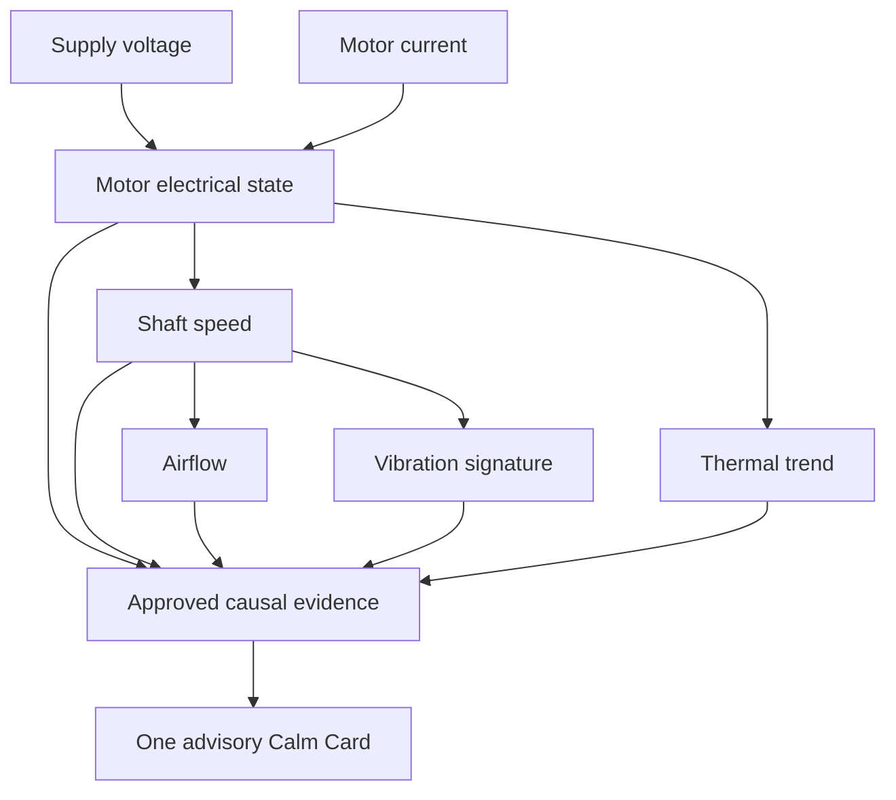

# Causal DAG Patterns and Explainable Physical Reasoning

PlantLens does not treat simultaneous alarms as proof of causation. Its approved directed acyclic graph (DAG) describes which physical relationships are plausible, which direction influence may travel, what timing is credible, and which observations are missing or unreliable.

## Architecture

Edges in this explanatory figure are candidate physical relationships, not proof that every associated sensor has been commissioned. The deployed runtime follows only human-approved edges present in its compiled graph. Missing or bad channels suppress conclusions rather than being zero-filled.

## Diagnostic patterns

| Pattern | Ordered physical evidence | Alternative hypotheses to reject | Safe output |
| --- | --- | --- | --- |
| Mechanical overload | Load rises; current/power increases; RPM falls; temperature may rise later. | Incoming voltage sag, stale current, disconnected tachometer. | Overload candidate only when the required channels and approved timing support it; otherwise insufficient data. |
| Supply disturbance | Voltage changes before motor current/RPM deviation; downstream airflow may fall. | Mechanical blockage, current-sensor scale error, timing skew. | Upstream electrical cause when the supply-to-motor edge is approved and the temporal order holds. |
| Rotor imbalance | Vibration or dominant spectral signature changes with shaft speed while supply remains comparatively stable. | Loose sensor mounting, stale vibration samples, external vibration. | Mechanical imbalance candidate only with trusted vibration and RPM evidence. |
| Bearing deterioration | Sustained or evolving vibration envelope precedes increased thermal trend and possible drag. | Short-duration impact, unrelated thermal load, uncommissioned vibration units. | Maintenance inspection recommendation, never an autonomous trip. |
| Airflow restriction | Flow decreases relative to RPM/load; downstream thermal behavior may worsen. | Failed airflow sensor, stopped fan, upstream electrical disturbance. | Restriction candidate only with quality-approved flow and machine-state context. |
| Sensor disconnection | Missing, stale, saturated, contradictory, or impossible values appear. | Actual machine fault inferred from invented replacement values. | `SENSOR_CHECK` / `INSUFFICIENT_DATA`; never assert a physical root cause without valid evidence. |
| Compound condition | More than one independently supported fault family persists with consistent timing. | Combinatorial overfitting or non-approved graph traversal. | Bounded PI-BFAST shadow hypothesis with explicit evidence and uncertainty. |
| Unknown behavior | A valid observation lies outside known healthy or labeled operating envelopes. | Forced nearest-label classification. | `UNKNOWN_FAULT` / human review. |

## Deterministic graph rules

1. Edges must be authored, validated, and approved before runtime use.
2. The runtime graph is acyclic and cannot be mutated by model predictions.
3. The same canonical `TagFrame` contract applies to simulator and industrial gateway input.
4. Signal freshness, quality, units, calibration, and approved timing gate every causal traversal.
5. Temporal precedence is necessary but insufficient: a permitted physical edge and supporting evidence are also required.
6. An uncommissioned native Modbus register remains a raw word, never an invented engineering signal.
7. Research ensemble and PI-BFAST outputs are shadow evidence, not direct production actuation or runtime graph edits.
8. Every recommendation remains advisory and human-approved.

## Implementation map

- Deterministic approved-graph runtime: [`apps/api/app/runtime/`](../../apps/api/app/runtime/).
- Evidence chain and approved-edge packet: [`evidence.py`](../../apps/api/app/runtime/evidence.py).
- Bounded compound-fault shadow tracker: [`factorial_shadow.py`](../../apps/api/app/edge_research/factorial_shadow.py).
- Quality-weighted fault experts: [`compact_ensemble.py`](../../apps/api/app/edge_research/compact_ensemble.py).
- Physical validation scenarios: [`VALIDATION_PROTOCOL.md`](VALIDATION_PROTOCOL.md).
- What is actually verified: [`EVIDENCE_LEDGER.md`](EVIDENCE_LEDGER.md).
